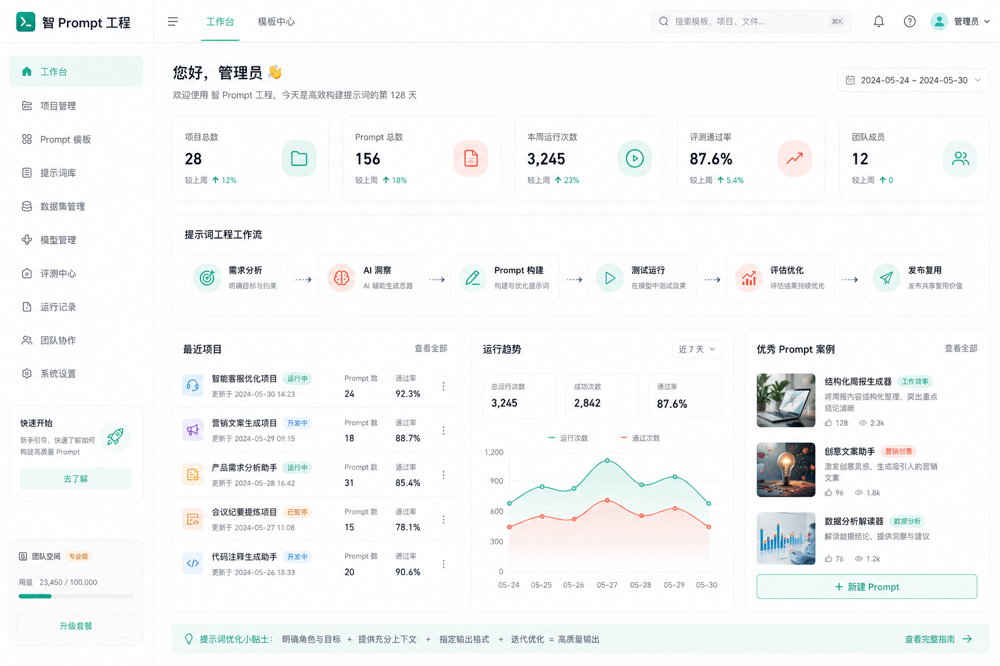
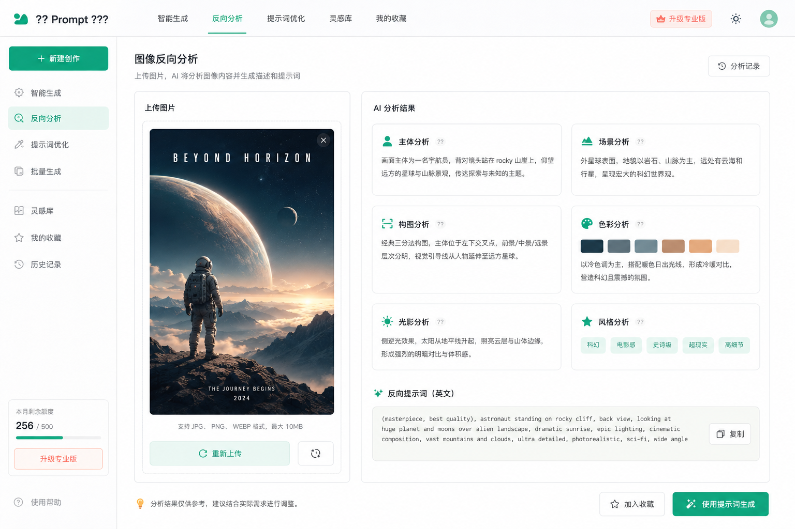
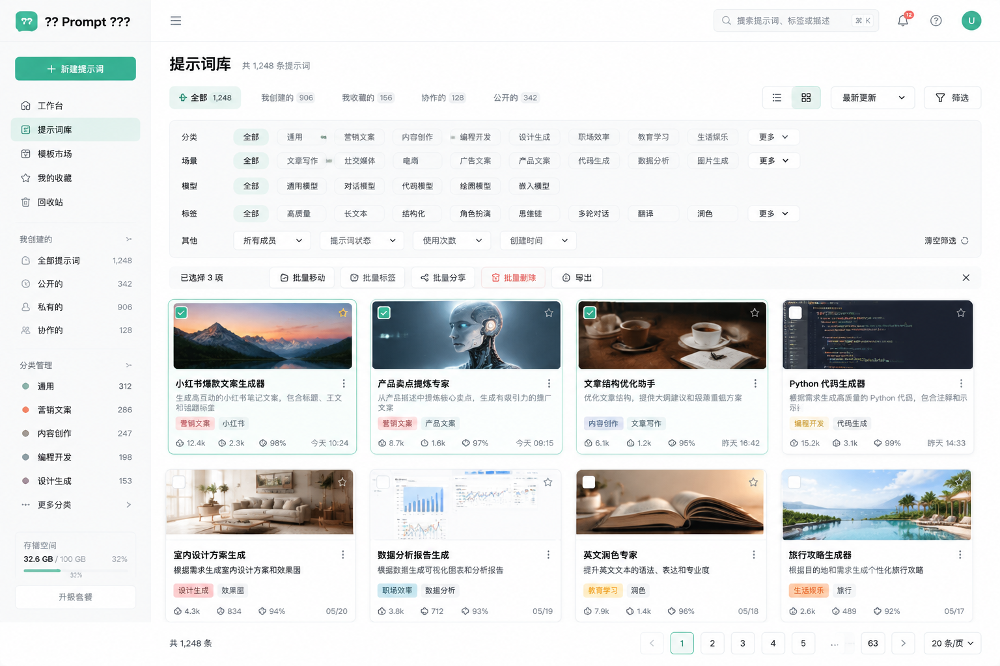
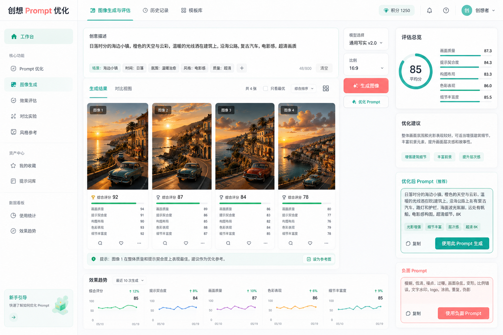

# 图像 Prompt 创作器

面向中文创作者、运营人员和视觉策划的本地 WebUI 工具。它可以从图片或已有 Prompt 出发，完成图片逆向分析、Prompt 拆解、风格迁移、测试图生成、效果评估、标签治理、合集整理、导出和本地备份。

> 所有效果图由项目配置的 image2 图片模型生成，用于展示产品方向和功能体验，不代表真实运行截图。



## 核心能力

- 图片逆向分析：上传图片后调用视觉模型，生成中文结构化分析和可迁移 Prompt。
- Prompt 模块拆解：把 Prompt 拆成主体、场景、构图、风格、色彩、光影、镜头、材质、情绪、文字区和 Negative 等模块。
- 风格迁移融合：保留原图风格资产，输入新需求后生成新的 image2 Prompt。
- 测试图生成：调用图片模型生成测试图，并保留 prompt 来源和原图血缘关系。
- 生成图评估：用视觉模型评估生成图效果，输出评分、问题和改良 Prompt。
- Prompt 库管理：分页浏览、标签筛选、批量删除、批量导出、批量加入合集。
- 标签治理：支持标签分类、层级、归档、合并、别名和自动治理记录。
- 批量逆向：最多 100 张图片逐张上传和队列式分析，失败项可单独重试。
- 本地运维：数据库统计、文件检查、备份下载、孤儿文件检查和最近错误日志。

## 功能效果图

### 图片逆向分析

上传图片后，系统会分析主体、风格、年代感、构图、色彩、光影、材质和选题价值，并生成 reverse prompt 与 negative prompt。



### Prompt 库与标签筛选

Prompt 库采用高密度分页列表，保留预览图、标题、标签、模块数量、迁移次数、版本数量、生成图数量和操作入口，详情信息仍在详情页完整展示。



### 图片生成与效果评估

生成图可以继续评估，系统会给出综合评分、Prompt 匹配度、风格保留度、问题说明和改良 Prompt。



## 技术栈

- Next.js App Router
- TypeScript
- Tailwind CSS
- Prisma
- SQLite
- OpenAI 官方 npm SDK
- OpenAI 兼容接口，支持自定义 `OPENAI_BASE_URL`

## 本地启动

```bash
npm install
npx prisma generate
npx prisma migrate dev
npm run dev
```

访问：

```text
http://localhost:3000
```

建议首次启动后依次检查：

1. `/diagnostics`：环境、Git、npm registry、代理端口、OpenAI `/models` 连通性。
2. `/settings`：AI 配置状态，API Key 只显示掩码。
3. `/maintenance`：数据库统计、文件夹大小、备份和日志状态。

## 环境变量

不要把 `.env.local` 提交到 GitHub。

```env
DATABASE_URL="file:./dev.db"
OPENAI_BASE_URL="https://linkapi.shop/v1"
OPENAI_API_KEY="sk-xxxx"
OPENAI_TEXT_MODEL="你的文本模型"
OPENAI_VISION_MODEL="你的视觉模型"
OPENAI_IMAGE_MODEL="你的图片模型"
MAX_UPLOAD_MB="15"
BATCH_MAX_UPLOAD_MB="40"
```

说明：

- `OPENAI_API_KEY` 只在服务端读取，不会暴露到前端。
- `OPENAI_BASE_URL` 默认兼容 `https://linkapi.shop/v1`。
- 图片分析使用 `OPENAI_VISION_MODEL`。
- Prompt 拆解、风格迁移、AI 标签建议使用 `OPENAI_TEXT_MODEL`。
- 测试图生成使用 `OPENAI_IMAGE_MODEL`。

## 常用命令

```bash
npm run check:env
npm run lint
npm run build
npm run dev
```

数据库迁移：

```bash
npx prisma generate
npx prisma migrate dev --name your_migration_name
```

批量生成图血缘回填：

```bash
npm run backfill:generated-origin
```

## 使用流程

### 从图片开始

1. 打开 `/analyze` 上传图片。
2. 点击“开始 AI 分析”生成结构化分析。
3. 点击“拆解 Prompt”得到 11 个 Prompt 模块。
4. 跳转 `/fusion` 输入新需求，生成风格迁移 Prompt。
5. 生成测试图并评估效果。
6. 将满意结果加入 Prompt 库、标签或合集。

### 从已有 Prompt 开始

1. 打开 `/import` 粘贴中文、英文、中英混合或模糊描述。
2. 选择 AI 语义整理或直接导入。
3. 进入 `/library/[id]` 查看结构化字段。
4. 继续拆解、风格迁移、生成测试图或加入合集。

### 批量图片逆向

打开 `/batch-analyze` 创建批量任务。系统支持最多 100 张图片，单张最大 40MB，逐张上传、逐张分析。失败图片不会影响其他图片，可以单独重试。

### 标签治理和 Prompt 库

打开 `/tags` 管理标签分类、层级、归档、合并和别名。打开 `/library` 可以通过搜索、标签、排序和分页快速定位 Prompt 记录。

### 本地备份

打开 `/maintenance` 创建 zip 备份。备份包含：

- `prisma/dev.db`
- `uploads/`
- `exports/`
- `docs/*.md`

备份不包含：

- `.env.local`
- `OPENAI_API_KEY`
- `node_modules`
- `.next`

## 安全边界

- API Key 不进入前端页面。
- 错误接口不返回完整 API Key。
- 上传文件、生成图、数据库和备份目录默认不提交 GitHub。
- `.gitignore` 已忽略 `.env.local`、`prisma/dev.db`、`uploads/`、`exports/`、`backups/` 和 `logs/`。
- 图片 Prompt 可以是中文、英文或中英混合；是否适合具体模型取决于模型能力。

## 版本检查点

- `v0.6.0-batch-analysis`：批量图片逆向 Prompt 分析工作流。
- `v0.7.0-library-governance`：标签治理与分页 Prompt 库。

## 常见问题

### npm install 卡住

先检查 registry：

```bash
npm config get registry
npm run check:env
```

必要时切换到可访问的 npm registry。

### OPENAI_BASE_URL 不通

检查 `.env.local` 中的 `OPENAI_BASE_URL`，然后打开 `/settings` 或 `/diagnostics` 查看 `/models` 连通性。

### 图片上传失败

确认图片格式为 JPEG、PNG 或 WebP，并检查 `MAX_UPLOAD_MB` 和 `BATCH_MAX_UPLOAD_MB`。

### 图片生成失败

确认 `OPENAI_IMAGE_MODEL` 已配置，并且模型支持图片生成。可以在 `/maintenance` 查看最近错误日志。

### dev.db 丢失

如果有备份，从 `/maintenance` 生成的 zip 中恢复 `prisma/dev.db` 和 `uploads/`。没有备份时，只能重新迁移并重新导入数据。

### 换电脑如何恢复

1. 克隆 GitHub 仓库。
2. 执行 `npm install`。
3. 解压备份中的 `prisma/dev.db`、`uploads/` 和 `exports/`。
4. 新建自己的 `.env.local`。
5. 执行 `npx prisma generate`。
6. 执行 `npm run dev`。
